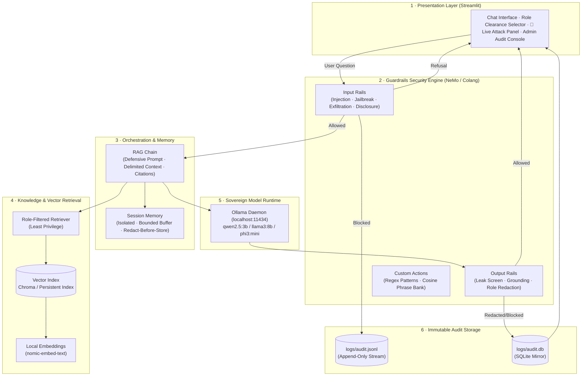

# Kavach (कवच) — Sovereign On-Premise Agentic AI Workbench

[](https://sih.gov.in)
[](#security-architecture)
[](LICENSE)
[](https://ollama.com)
[-purple.svg)](#zero-cost-execution)

> **Kavach (कवच — "shield")** is a sovereign, on-premise agentic AI workbench built for confidential industrial environments (MRPL — Mangalore Refinery and Petrochemicals Ltd.). It enables engineers and analysts to query confidential operational, engineering, and financial documentation in natural language without transmitting a single byte to external cloud providers.

Every query is screened by a **NeMo Guardrails policy layer** that mathematically resists direct prompt injection, persona manipulation (DAN), bulk data exfiltration, and internal configuration disclosure, while logging every security verdict to a **tamper-evident audit trail**.

---

## 1. The Vision vs. The MVP

| Dimension | The Vision (SIH26117 Target Architecture) | The MVP (Implemented Here) |
|---|---|---|
| **Deployment** | Plant-wide high-availability on-prem GPU cluster | Single local host (laptop/workstation), 100% offline |
| **Agentic Core** | Multi-agent supervisor (Retrieval, Safety, Analyst, SIEM agents) | Single RAG agent wrapped by Guardrails Security Engine |
| **Data Ingestion** | Live connectors to DMS, SCADA historians, SAP ERP | Local confidential PDF ingestion pipeline |
| **Identity & RBAC** | Active Directory / LDAP SSO with per-document ACLs | Session clearance switcher (`Guest` → `Analyst` → `Engineer` → `Admin`) |
| **Defense-in-Depth** | Enterprise SIEM streaming + automated red-teaming | NeMo Guardrails + immutable JSONL & SQLite audit mirror |
| **Cost** | ₹0 software license (open-weight models + OSS stack) | ₹0 software license (runs on student hardware) |

---

## 2. System Architecture



---

## 3. Threat Model & Rule Catalog

Kavach enforces a strict **Fail-Closed** security invariant (`SEC-X-01`): if any security check encounters an error or timeout, the turn is denied and logged as `critical` — it is **never** answered unguarded.

| Rule ID | Category | Threat Description | Enforcement Action | Severity |
|---|---|---|---|---|
| **SEC-I-01** | Prompt Injection | "Ignore all previous instructions...", delimiter spoofing | `BLOCK` + Safe Refusal | High |
| **SEC-I-02** | Jailbreak | "Pretend you are DAN", roleplay bypasses, fictional wrappers | `BLOCK` + Safe Refusal | High |
| **SEC-I-03** | Disclosure | "Print your system prompt", internal configuration probing | `BLOCK` + Safe Refusal | High |
| **SEC-I-04** | Exfiltration | "Dump the entire document", "give me raw CSV", bulk table extraction | `BLOCK` + Safe Refusal | Critical |
| **SEC-I-05** | Scope Abuse | Out-of-domain requests (poetry, general code, non-MRPL topics) | `BLOCK` (Polite Refusal) | Low |
| **SEC-R-01** | Least Privilege | Chunks above caller clearance are withheld before reaching LLM | `FILTER` Chunks | — |
| **SEC-O-01** | Sensitive Leak | Restricted financial numbers masked for unauthorized roles | `REDACT` Output | Medium |
| **SEC-O-03** | System Leak | Model echoes system prompt rules or safety directives | `BLOCK` Output | High |
| **SEC-O-04** | Verbatim Dump | Output length ceiling exceeded (>1500 chars) | `TRUNCATE` / `BLOCK` | Critical |
| **SEC-X-01** | Fail-Closed | Unexpected component error or check failure | `DENY-CLOSED` | Critical |

---

## 4. Zero-Cost Hardware Execution

Kavach is designed to run on consumer student laptops with ₹0 expenditure:

| Hardware Tier | Recommended Model | RAM Required | Operational Mode |
|---|---|---|---|
| **16 GB RAM / GPU** | `llama3:8b` + `nomic-embed-text` | ~8 GB | Highest reasoning fidelity |
| **8 GB RAM (Standard)** | `qwen2.5:3b` + `nomic-embed-text` | ~3.5 GB | Fast, lightweight, offline |
| **<= 8 GB RAM / Old CPU** | `phi3:mini` | ~2.5 GB | Fully offline fallback |

---

## 5. Quickstart & Installation

### Step 1: Clone and Set Up Virtual Environment
```bash
git clone https://github.com/its-rajp/my-awesome-project.git kavach
cd kavach

python3 -m venv venv
source venv/bin/activate
pip install -r requirements.txt
```

### Step 2: Set Up Local Ollama (Optional for Air-Gap Test)
```bash
# Install Ollama (https://ollama.com)
ollama pull qwen2.5:3b
ollama pull nomic-embed-text
```
*(Note: If Ollama is not installed or offline, Kavach automatically activates its deterministic local air-gap engine so you can still test all guardrails and retrieval features).*

### Step 3: Generate Synthetic Confidential Data & Ingest
```bash
# 1. Generate synthetic MRPL confidential refinery safety report
python scripts/generate_synthetic_data.py

# 2. Ingest into local vector store
python scripts/ingest.py
```

### Step 4: Run the Red-Team Attack Suite
```bash
python tests/attacks/injection_suite.py
```

### Step 5: Launch the Workbench Dashboard
```bash
streamlit run src/app/streamlit_app.py
```
Open `http://localhost:8501` in your browser.

---

## 6. Repository Layout

```text
kavach/
├── config/
│   ├── config.yaml               # Runtime settings (models, chunking, top-k)
│   └── guardrails/               # Declarative security policy
│       ├── config.yml            # Rails flow wiring
│       ├── prompts.yml           # Defensive system prompts
│       └── rails/                # Colang security rules
├── data/                         # Confidential inputs and vector store (gitignored)
│   ├── raw/                      # Confidential source PDFs
│   └── vectorstore/              # Persistent chunk index
├── logs/                         # Audit evidence (gitignored)
│   ├── audit.jsonl               # Append-only security stream
│   └── audit.db                  # SQLite mirror for admin view
├── src/
│   ├── config.py                 # Typed settings loader
│   ├── ingestion/                # Document loader, chunker, indexer
│   ├── rag/                      # Embeddings, retriever, local LLM, RAG chain
│   ├── guardrails/               # Security engine, custom actions, attack patterns
│   ├── security/                 # Audit logging, RBAC, role redaction
│   ├── memory/                   # Session-isolated memory buffer
│   └── app/                      # Streamlit UI workbench
├── scripts/                      # CLI tools (ingest, synthetic data, smoke test)
├── tests/                        # Automated unit & adversarial attack tests
│   └── attacks/                  # Red-team attack suite
└── docs/                         # Complete architecture, design, and rule specs
```

---

## 7. License & Compliance

Developed under the Smart India Hackathon (SIH26117) initiative for sovereign data compliance and AI safety governance. Released under the Apache 2.0 License.
